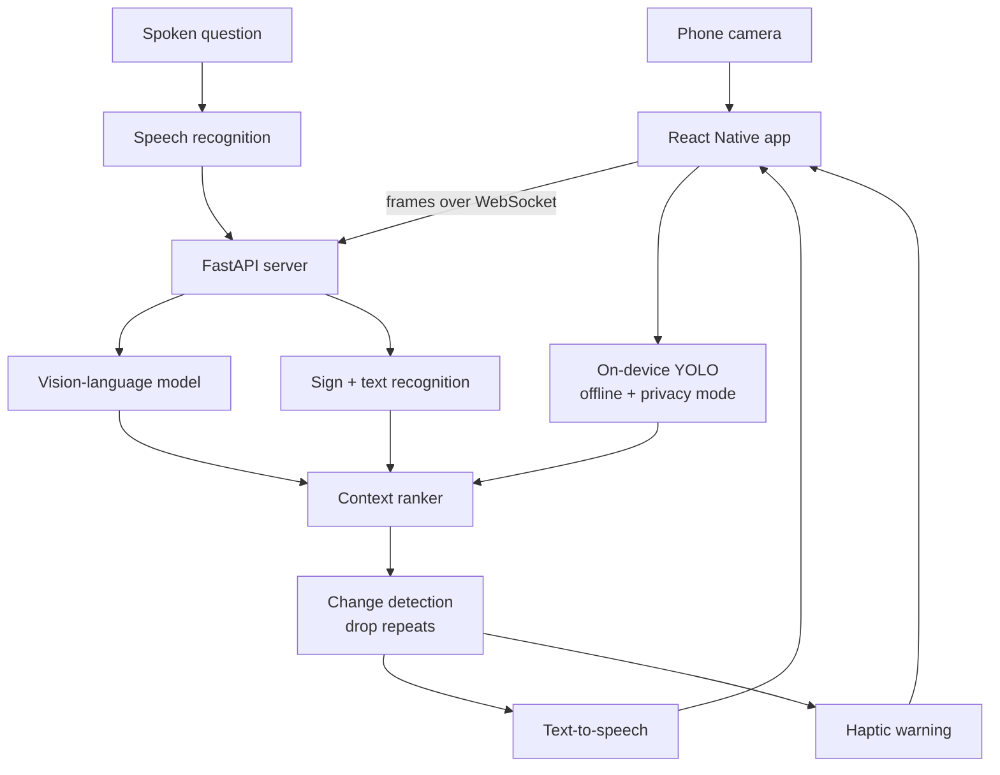

# EchoLens — Context-Aware Scene Description

A context-aware AI assistant that describes visual environments for users with low vision.

[](https://github.com/chethanpos23-ui/echolens/actions/workflows/ci.yml)
[](LICENSE)

> **Portfolio case study.** EchoLens was built as a **HackMIT 2025 · Best Use of AI** project and is
> published here as an educational case study. This repository documents the design, the
> reasoning behind it, and the constraints — read [Limitations](#limitations) before
> assuming any part of it is production-ready.

---

## The Problem

Scene-description apps for blind and low-vision users tend to fail in the same way:
they describe everything. Point a camera down a hallway and you get a paragraph about the carpet
pattern, the ceiling tiles, and a poster on the wall — while the open door and the person walking
toward you go unmentioned until the paragraph is over.

The problem is not detection quality. It is ranking. A description that arrives fifteen seconds
late, buried under detail, is not accessible.

## Our Solution

EchoLens ranks before it speaks.

The vision pipeline runs continuously, but a context-ranking layer sits between detection and
speech. It scores each detected element by what actually matters when moving through a space:
obstacles and their distance, doorways, transit signage, people, and — critically — whether
anything has *changed* since the last utterance. A wall that was there five seconds ago is not
news.

The user can also ask. Speech in, audio out, answered against the current frame. Narration detail
is adjustable from terse obstacle warnings to full scene description, and a privacy mode keeps
selected tasks on-device.

## Demo

<!-- Replace the placeholders below with your own recording and screenshots.
     A 60-90 second video and three screenshots is the format that reads best. -->

| | |
|---|---|
| **Video** | _Add a link to a demo recording_ |
| **Screenshots** | _Add images to `docs/images/` and reference them here_ |
| **Live instance** | Not deployed — see [Local Setup](#local-setup) to run it |

## Features

- Real-time scene descriptions
- Text and sign recognition
- Obstacle and doorway detection
- Spoken questions and audio responses
- Indoor navigation cues
- Adjustable narration detail
- Haptic warnings for nearby obstacles
- Privacy mode that processes selected tasks locally
- Saved-location labels
- Confidence indicators for uncertain detections

## Architecture



```
echolens/
├── mobile/               # React Native client
├── server/               # FastAPI + WebSocket vision service
├── models/               # model configs and on-device weights
├── accessibility-tests/  # screen-reader and walkthrough test plans
├── evaluation/
│   ├── latency-results.csv
│   └── description-quality.md
├── docs/
├── demo/
└── README.md
```


Further reading:

- [`docs/architecture.md`](docs/architecture.md)
- [`evaluation/description-quality.md`](evaluation/description-quality.md)
- [`evaluation/latency-results.csv`](evaluation/latency-results.csv)

## Technology

| Layer | Technology |
|---|---|
| Mobile | React Native |
| Server | Python, FastAPI, WebSockets for the streaming channel |
| Vision | Vision-language model for description, YOLO for on-device object detection, OpenCV for frame preprocessing |
| Speech | Whisper-compatible recognition in, text-to-speech out |
| Local storage | SQLite for preferences and saved-location labels |

## My Contribution

- Implemented the real-time vision pipeline over a WebSocket streaming channel
- Created the context-ranking system that decides what is worth saying
- Reduced duplicate descriptions by diffing against the previous utterance
- Added offline object detection so obstacle warnings survive a dead connection
- Ran simulated accessibility testing with screen-reader and blindfold walkthroughs

## Local Setup

**Prerequisites:** Docker and Docker Compose, or the individual runtimes listed under
[Technology](#technology).

```bash
git clone https://github.com/chethanpos23-ui/echolens.git
cd echolens

# server
cd server && pip install -r requirements.txt && uvicorn main:app --reload

# mobile (separate terminal)
cd mobile && npm install && npx expo start
```

Set `ECHOLENS_SERVER_URL` in `mobile/.env` to your machine's LAN address — `localhost` will not
resolve from a phone.

## Testing

The repository ships structural and documentation tests that run on every push:

```bash
python -m pip install pytest
python -m pytest tests -v
```

These verify that the repository keeps the shape its documentation describes — required files
and directories exist, every README section is present, and no credential-shaped strings have
been committed. Application-level test suites belong alongside the code they cover, in each
component directory.

## Limitations

This is a hackathon prototype. The honest constraints:

- Latency depends on network quality. On a weak connection the app falls back to on-device detection, which recognizes fewer object classes.
- Depth is estimated monocularly. Distance warnings are approximate and degrade in low light.
- Sign recognition is English-only in this prototype.
- Accessibility testing was simulated by sighted developers. It has not been validated with blind or low-vision users, which is the single largest gap.

## Responsible Use

EchoLens is a prototype and must not be treated as a replacement for a
mobility aid, trained guide, or safety-critical navigation system.

Detections carry confidence indicators for a reason: the system is wrong sometimes, and it is wrong
most often in exactly the conditions where being wrong matters — poor light, fast movement,
unfamiliar spaces. It is built to supplement a cane, a guide dog, or a companion, never to stand in
for one.

## Future Improvements

- Testing with blind and low-vision users, which every other item here depends on
- Stereo or LiDAR depth on devices that expose it
- Multilingual sign recognition
- A fully on-device pipeline so the network is optional rather than preferred

## Team

Built by **Chethan Posani** ([@chethanpos23-ui](https://github.com/chethanpos23-ui)) and teammates at
HackMIT 2025.

<!-- Add your teammates here with links to their GitHub profiles. Attribution matters —
     if this was a team project, the README should say who did what. -->

My own contribution is listed under [My Contribution](#my-contribution).

## License

[MIT](LICENSE) © 2026 Chethan Posani
