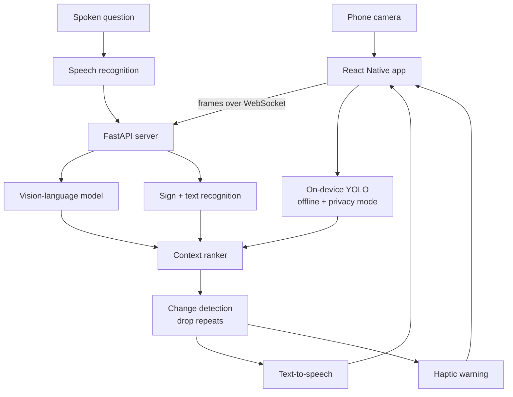

# Architecture

## Overview



## Repository layout

```
echolens/
├── mobile/               # React Native client
├── server/               # FastAPI + WebSocket vision service
├── models/               # model configs and on-device weights
├── accessibility-tests/  # screen-reader and walkthrough test plans
├── evaluation/
│   ├── latency-results.csv
│   └── description-quality.md
├── docs/
├── demo/
└── README.md
```

## Components

EchoLens ranks before it speaks.

The vision pipeline runs continuously, but a context-ranking layer sits between detection and
speech. It scores each detected element by what actually matters when moving through a space:
obstacles and their distance, doorways, transit signage, people, and — critically — whether
anything has *changed* since the last utterance. A wall that was there five seconds ago is not
news.

The user can also ask. Speech in, audio out, answered against the current frame. Narration detail
is adjustable from terse obstacle warnings to full scene description, and a privacy mode keeps
selected tasks on-device.

## Technology by layer

| Layer | Technology |
|---|---|
| Mobile | React Native |
| Server | Python, FastAPI, WebSockets for the streaming channel |
| Vision | Vision-language model for description, YOLO for on-device object detection, OpenCV for frame preprocessing |
| Speech | Whisper-compatible recognition in, text-to-speech out |
| Local storage | SQLite for preferences and saved-location labels |

## Design decisions worth explaining

- Implemented the real-time vision pipeline over a WebSocket streaming channel
- Created the context-ranking system that decides what is worth saying
- Reduced duplicate descriptions by diffing against the previous utterance
- Added offline object detection so obstacle warnings survive a dead connection
- Ran simulated accessibility testing with screen-reader and blindfold walkthroughs

## Known constraints

- Latency depends on network quality. On a weak connection the app falls back to on-device detection, which recognizes fewer object classes.
- Depth is estimated monocularly. Distance warnings are approximate and degrade in low light.
- Sign recognition is English-only in this prototype.
- Accessibility testing was simulated by sighted developers. It has not been validated with blind or low-vision users, which is the single largest gap.

See the [README](../README.md) for the full context, and
[`SECURITY.md`](../SECURITY.md) for how to report a problem.
